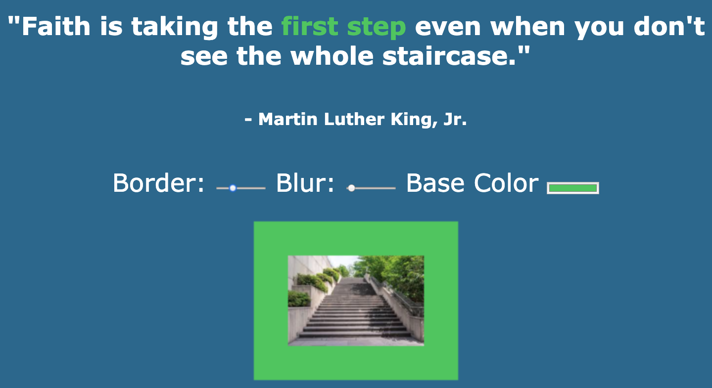

# JavaScript30

Grab the course at [https://JavaScript30.com](https://JavaScript30.com)

SUMMARY: Today I learned about CSS variables and how these can be manipulated using JavaScript. The advantage of doing this is so that as we interact with features on the page the CSS will update in response. I also had a lot of fun trying out some new input types, like range and color!